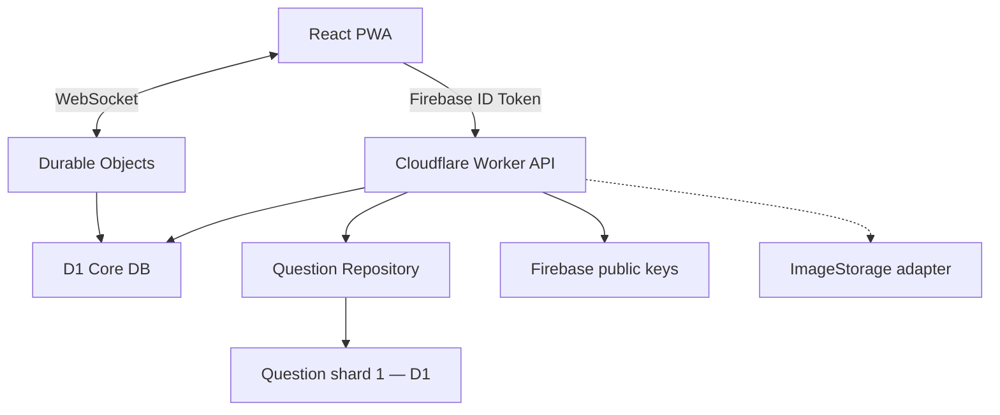

# Arquitetura

## Visão geral

O repositório é um npm workspace:

- `apps/web`: SPA/PWA React;
- `apps/worker`: API, D1 e Durable Objects;
- `packages/domain`: regras puras e testáveis, sem dependência de navegador/Cloudflare.

## Fronteiras

### Web

Responsável por apresentação, acessibilidade, animações, sessão Firebase no cliente e projeção local do deadline. Não calcula resultados autoritativos nem recebe respostas futuras.

### Worker API

Termina autenticação, valida schemas, aplica autorização e oferece APIs HTTP. Queries passam por repositories. Respostas autenticadas e competitivas recebem `Cache-Control: no-store`.

### Durable Objects

Um objeto serializa o estado de uma fila ou sala. O backend SQLite é obrigatório para compatibilidade com Workers Free. WebSocket Hibernation evita cobrar duração ociosa. A sala persiste toda transição, usa alarmes para preparação/deadlines/revelação/reconexão e mantém anexos de WebSocket serializados para retomada sem memória global. Presença efêmera não vira escrita constante no D1.

### D1

Core DB guarda conta, social, rankings, matches e metadados. Question repositories aceitam um `shardId`; inicialmente o binding `QUESTIONS_DB` pode apontar para o mesmo D1, mas nenhuma UI ou regra depende disso.

### Domain

Contém ranking, XP, scoring, anti-repetição, bitmap histórico e seleção uniforme. Funções usam entradas explícitas e fontes de aleatoriedade/tempo injetáveis nos testes.

## Autenticação Firebase em Workers

O cliente chama `getIdToken()` e envia `Authorization: Bearer <token>`. O Worker:

1. exige JWT com `alg=RS256` e `kid`;
2. busca certificados X.509 oficiais de `securetoken@system.gserviceaccount.com`;
3. respeita `Cache-Control: max-age` e mantém cache em memória;
4. verifica assinatura com `jose`/Web Crypto;
5. verifica `aud=quizgomes-cbc48`;
6. verifica `iss=https://securetoken.google.com/quizgomes-cbc48`;
7. verifica `exp`, `iat`, `auth_time` e `sub` não vazio;
8. usa apenas `sub` como Firebase UID.

Fontes oficiais:

- <https://firebase.google.com/docs/auth/admin/verify-id-tokens>
- <https://developers.google.com/identity/gsi/web/guides/verify-google-id-token>

Não é usada Service Account para verificar assinatura. Revogação global de token não é consultada em toda requisição porque exigiria Admin API/credenciais; ações críticas podem futuramente adicionar esse controle conforme ameaça e custo.

## Administração

`ADMIN_FIREBASE_UIDS` é uma lista no ambiente do Worker. O bootstrap cria/garante a role no D1 após login válido. Guards administrativos verificam bootstrap e/ou role persistida. Nenhuma role é derivada de email/nome, e a UI oculta é apenas conveniência visual.

## Consistência e idempotência

- `active_match_players.user_id` exclusivo impede o mesmo usuário em duas partidas.
- `matches.result_version` e chave única no ledger impedem resultado duplicado.
- Finalização usa um batch transacional: trava estado final e grava ledger, ranking, XP, respostas, histórico do pool e liberação dos locks; retries observam o resultado já aplicado.
- Requests mutáveis aceitam `Idempotency-Key` quando repetição de rede é provável.
- Slots do pool são alterados por swap com o último slot na mesma transação.
- Estado usuário+pool usa versão otimista para evitar perda concorrente.

## Estado de partida

Estados de presença competitiva: `idle`, `matchmaking`, `invite`, `preparing`, `playing`, `reconnecting` e `finished`. Transições inválidas são rejeitadas pelo servidor.

Cada rodada separa:

- payload público atual: enunciado, alternativas, imagem, pergunta X/Y e tempo restante derivado do deadline do servidor;
- segredo do servidor: alternativa correta, respostas, tempo capturado e score calculado;
- sinal do adversário: somente cinza/amarelo até a resolução, sem alternativa ou correção;
- revelação: alternativa correta e score adversário somente quando a rodada está resolvida para ambos.

O cliente envia somente READY, número da rodada, ID da pergunta e opção escolhida. Campos extras (score, tempo, resposta correta ou resultado) invalidam a mensagem. A partida pausa integralmente por uma única queda, preserva `phaseRemainingMs` por até 7 s e diferencia abandono individual de dupla queda/falha sistêmica.

## Segurança HTTP

- CSP, `X-Content-Type-Options`, `Referrer-Policy`, `Permissions-Policy` e HSTS em produção;
- CORS restrito a origens configuradas;
- JSON com limite de tamanho;
- Zod para input;
- IDs do recurso sempre combinados com UID autorizado para evitar IDOR;
- respostas de API sem HTML arbitrário; React escapa texto por padrão;
- sem secrets em código, logs ou payloads.

## PWA

O service worker precacheia somente shell/assets versionados. `/api/**`, Firebase auth endpoints e WebSockets usam rede e nunca cache competitivo. O app permanece navegável offline apenas no shell, com estado explícito de indisponibilidade para funções online.

## Armazenamento de imagens

`ImageStorage` expõe leitura de metadata/URL e escrita administrativa futura. `LocalImageStorage` serve fixtures. `R2ImageStorage` é uma futura implementação; não existe binding/provisionamento agora.
